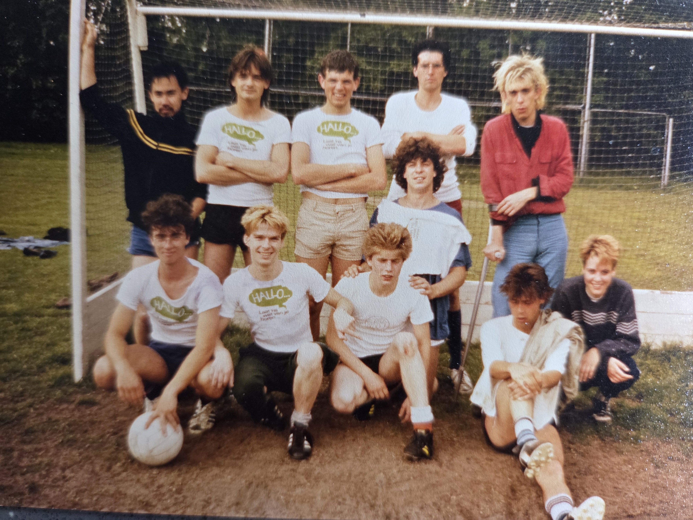

+++
title = "Van Vrienden"
+++

Stuur ons gerust wat foto's of verhalen.  
Gebruik dit email adres: <uitvaartrobbie@gmail.com>

## Ad ##

Hoi, hoi,  

Bij deze hoort nog wel een leuk verhaal. Robbie was i.h.a. niet zo van de gemeenschappelijke events en tradities zoals bv bij O&N. We hadden met O&N 1980 een feestelijk diner georganiseerd. Hij wilde dan ook niks weten een speciaal moment om 12 uur, dat we mekaar dan gingen omhelzen en zo. Hij stelde voor om alle horloges in te leveren en het '12 uur moment' zondermeer voorbij te laten gaan. Zo gezegd, zo gedaan. Maar we hadden stiekem een wekker achter zijn rug opgehangen, zonder dat hij dat door had. Zie foto! We hebben erg gelachen!  
Groet, Ad

  

### Robbie op Cyprus ###

  

### Robbie op OD15 ###

  
  
  
  
  
  
  

## Eus ##

Wat ontzettend triest dat Robbie er niet meer is. Van harte gecondoleerd.  
Jarenlang zat ik regelmatig in (Paul en Coby's) De Klok 's avonds te lezen of te schrijven. Ook besprak ik er nog weleens een boek met iemand. We zaten dan rechts achterin de zaak. Als Robbie naar het toilet ging, schoot hij mij/ons altijd even aan.
"Ik zal je niet storen, hoor."
"Dag Robbie."
"Is het een goed boek? Waar gaat het over?"
Voor je het wist, was je een kwartier verder.

## Jan ##

Ik wil Robbie eren met een pagina op mijn Delft scheurkalender.  
Is het mogelijk dat jullie een levensverhaal van hem schrijven in max 310 woorden.  
  
groet,  
Jan

## Ad ##

Ik vond in mijn archief nog een foto, waar Robbie (2e links) en ik (2e van rechts) samen opstaan.
Op een vrijdagavond in de Klok aan Robbie beloofd, dat ik die zaterdagochtend erop zijn voetbalelftal zou komen versterken, omdat ze 'een mannetje tekort' kwamen. Robbie was dat (ondanks zijn flinke alcoholinname) wel gewend, maar nadat ik 1 keer het hele veld was over gerend, was ik helemaal compleet verrot en hadden ze eigenlijk niks meer aan me!
Ik mocht wel mee op de foto!😉

## Karin ##

Ik kom zaterdag naar de afscheidsborrel van Robbie. En ik neem een fles “stoli” mee om Robbie en onze legendarische reis naar Moskou en Leningrad nog een keer in gepaste stijl te herdenken. 😜

Tot dan,
Karin

## Elisabeth ##

Allereerst familie en vrienden  van harte gecondoleerd  

Heb hele goede herinneringen aan vriend Robbie uit mijn jonge jaren.
Later is de vriendschap verwaterd en ben ik verhuist uit Delft naar Driebergen.  

Via Peter hoorde ik van het overlijden en de  vier-robbies-leven-borrel.
Graag hoor ik over de laatste jaren van Robbie , hij was zo bijzonder met zijn cynische humor  
en een hart van goud. Een nieuwe eeuwige STER is geboren................vaarwel mijn ster  ........de herinnering blijft.

Dank voor je vriendschap.

Tot dan a.s. zaterdag  Elisabeth
