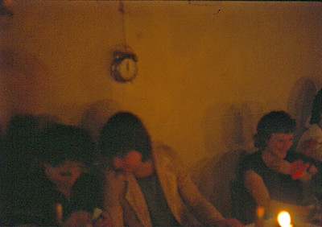
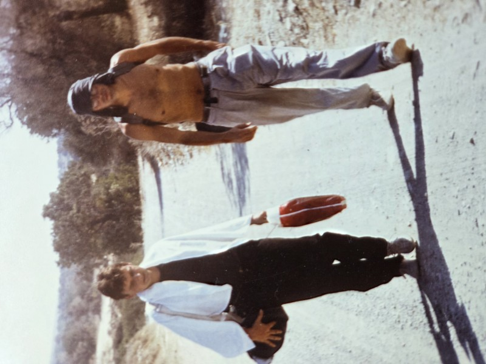
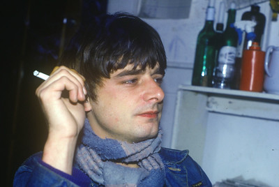
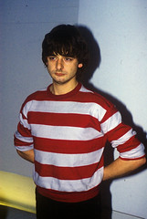
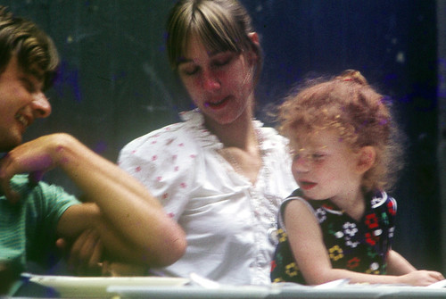
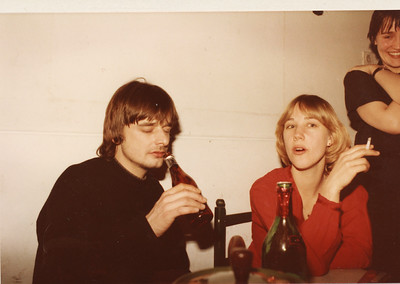
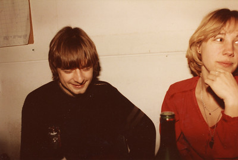
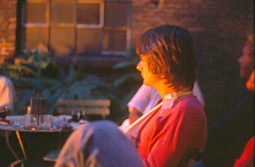
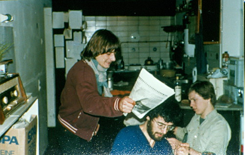

+++
title = "Van Vrienden"
+++

Stuur ons gerust wat foto's of verhalen.  
Gebruik dit email adres: <uitvaartrobbie@gmail.com>

## Ad ##

Hoi, hoi,  

Bij deze hoort nog wel een leuk verhaal. Robbie was i.h.a. niet zo van de gemeenschappelijke events en tradities zoals bv bij O&N. We hadden met O&N 1980 een feestelijk diner georganiseerd. Hij wilde dan ook niks weten een speciaal moment om 12 uur, dat we mekaar dan gingen omhelzen en zo. Hij stelde voor om alle horloges in te leveren en het '12 uur moment' zondermeer voorbij te laten gaan. Zo gezegd, zo gedaan. Maar we hadden stiekem een wekker achter zijn rug opgehangen, zonder dat hij dat door had. Zie foto! We hebben erg gelachen!  
Groet, Ad

  

### Robbie op Cyprus ###

  

### Robbie op OD15 ###

  
  
  
  
  
  
  

## Eus ##

Wat ontzettend triest dat Robbie er niet meer is. Van harte gecondoleerd.  
Jarenlang zat ik regelmatig in (Paul en Coby's) De Klok 's avonds te lezen of te schrijven. Ook besprak ik er nog weleens een boek met iemand. We zaten dan rechts achterin de zaak. Als Robbie naar het toilet ging, schoot hij mij/ons altijd even aan.
"Ik zal je niet storen, hoor."
"Dag Robbie."
"Is het een goed boek? Waar gaat het over?"
Voor je het wist, was je een kwartier verder.

## Jan ##

Ik wil Robbie eren met een pagina op mijn Delft scheurkalender.  
Is het mogelijk dat jullie een levensverhaal van hem schrijven in max 310 woorden.  
  
groet,  
Jan
